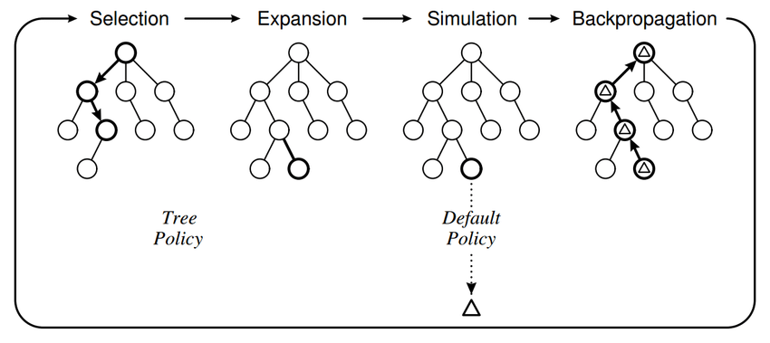

# Improving HARP's Design Space Exploration with RL and MCTS
- CS259 Chip Design Automation and Deep Learning Final Project @UCLA, Fall 2024
- Instructors: Jason Cong, Yizhou Sun
- Contributors: Yu-Hsin Weng, Yi-Chun Lo, Ryan Chen

## Introduction
The growing complexity of modern design spaces for high-level synthesis (HLS) has posed significant challenges in optimizing microarchitecture configurations for field-programmable gate arrays (FPGAs). Traditional design space exploration (DSE) methods, such as exhaustive search, often become computationally infeasible due to the vast number of configurations and the long runtime required to evaluate each design. Advanced methodologies, such as Hierarchical Augmentation for Representation with Pragma Optimization (HARP), have been developed to address this issue by leveraging Graph Neural Networks (GNNs). HARP introduces a hierarchical graph representation that captures both program semantics and pragma transformations, enhancing its ability to model and predict design performance. While HARP has shown significant advancements in improving prediction accuracy and transfer learning capabilities, its reliance on deterministic heuristics leaves room for improvement in efficiently navigating vast and complex design spaces.

Monte Carlo Tree Search (MCTS) offers a promising solution for addressing these limitations. MCTS is a heuristic search algorithm that balances exploration and exploitation, making it ideal for large decision spaces like DSE. The algorithm operates through four phases: selection, expansion, simulation, and backpropagation. During the selection phase, MCTS traverses the search tree using an Upper Confidence Bounds (UCB) scoring mechanism, which balances the trade-off between exploring less-visited nodes and exploiting nodes with high performance. This is followed by expansion, where new child nodes are added to the search tree. Simulation then evaluates these nodes using a default policy, and backpropagation updates the parent nodes with the simulation results. This iterative process allows MCTS to focus computational resources on the most promising areas of the design space.

To further enhance the robustness and efficiency of DSE, this project combines MCTS with Reinforcement Learning (RL). While MCTS provides a structured approach to decision-making, RL introduces adaptive policies that learn from past experiences to improve the exploration process. By integrating these two methodologies with HARP’s hierarchical representations, our approach seeks to overcome the limitations of static heuristics, enabling scalable and efficient optimization of FPGA designs.

The objective of this project is to demonstrate the synergistic benefits of combining HARP, MCTS, and RL for DSE in HLS. We aim to reduce computational overhead, improve scalability, and achieve superior optimization results. This report will detail the challenges faced, the related work that inspired our approach, our experimental setup, and the results obtained. Finally, we will discuss the lessons learned, potential future improvements, and the division of work among the team.

## To run the project
```
# clone the repo in your home directory
git clone https://github.com/WWW0828/cs259-final-project.git
# attach to a tmux session
tmux a      # or create one with: tmux
# pull docker container
docker pull ghcr.io/ucla-vast/hls-vast-lab:latest
# run docker
docker run --user $(id -u):100 -v /d0/class:/home -it ghcr.io/ucla-vast/hls-vast-lab:latest /bin/bash
# mount home directory to docker
export HOME=/home/[your sID]
# modify config.py (if needed) and run main.py
cd cs259-final-project/HARP/src
python3 -W ignore main.py
```
## Technical Details
### 1. Reinforcement Learning
- **Reward Function**: Compute by HARP's regression model that will predict design configurations latency and resource usage.
- **Policy Network**: Given the current state (design), output the probability distribution of actions (action: inserting pragma p at loop l with factor f)
- **Value Network**: Given the current state (design), output the estimated design quality (compute with some formulas using information such as valid or not, latency, resources usage)
### 2. Monte Carlo Tree Search (MCTS)


- **Selection**: Starting at the root node, the algorithm traverses the tree using Upper Confidence Bounds (UCB) scoring mechanism to balance exploration and exploitation.
- **Expansion**: Upon reaching a leaf node, the algorithm expands the tree by introducing new nodes representing the next possible pragma modifications.
- **Simulation**: The newly added nodes undergo simulation to evaluate their performance based on predefined objectives, such as latency or resource utilization.
- **Backpropogation**: Results from the simulations are propagated back up the tree, updating the node statistics to inform future decisions.

## References
### HARP:  Robust GNN-based Representation Learning for HLS
- [github](https://github.com/UCLA-VAST/HARP), [paper](https://ieeexplore.ieee.org/document/10323853)

```
@inproceedings{harp2023,
    title={Robust GNN-based Representation Learning for HLS},
    author={Sohrabizadeh, Atefeh and Bai, Yunsheng and Sun, Yizhou and Cong, Jason},
    booktitle={In Proceedings of the 42nd IEEE/ACM International Conference on Computer-Aided Design (ICCAD)},
    year={2023}
}
```
